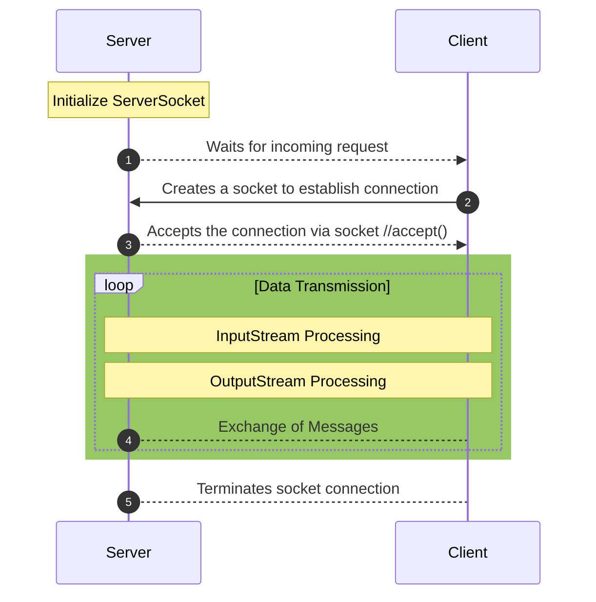

# TCP_Programming
 
## Socket Introduction

## Implementation Description

The game that will be modeled is called hot potato, in which there are some number of players who quickly toss a potato from one player to another until, at a random point, the game ends and the player holding the potato is “it”. The object is to not be the one holding the potato at the end of the game. In this assignment, you will create a ring of “player” processes that will pass the potato around. Thus, each player process has a left neighbor and a right neighbor. Also, there will be a “ringmaster” process that will start each game, report the results, and shut down the game.

The game that you will work on follows the following process:
1. To begin, the ringmaster creates a “potato” object initialized with some number of hops and sends the potato to a randomly selected player.
2. Each time a player receives the potato, the player will decrement the number of hops and append the player’s ID (which is the id number assigned to each player as described in the Communication Machanism section below) to the potato. Then, this player who is holding the potato will choose next step based on the remaining number of hops as bellow:
- If the remaining number of hops is greater than zero, the player will randomly select a neighbor and send the potato to that neighbor.
- The game ends when the hop counter reaches zero. The player holding the potato sends it to the ringmaster, indicating the end of the game. The ringmaster prints a trace of the game to the screen (using the player identities that are appended to the potato), and shuts the game down (by sending a message to each player to indicate they may shut down as the game is over). 

The assignment is to create one ringmaster process and some number of player processes, then play a game and terminate all the processes gracefully. You may explicitly create each process from an interactive shell; however, the player processes must exit cleanly at the end of the game in response to commands from the ringmaster.
	
Based on the description above, the ringmaster side will be responsible for the following:
1. Establish N network socket connections with N number of players and provide relevant
information to each player (see Communication Machanism section below for details)
2. Create a “potato” object as described above
3. Randomly select a player and send the “potato” to the selected player
4. At the end of the game (when the ringmaster receive the potato from the player who is
“it”), print a trace of the potato to the screen
5. Shut the game down by sending a message to each player

The player side will be responsible for the following:
1. Establish three network socket connections for communication:
- with the player to the left
- with the player to the right
- with the ringmaster
2. Keep listening to the three channels as “potato” can arrive on any of these three
channels. Note that commands and important information may also be received from the
ringmaster.
3. Properly handle everything received based on game rules.
