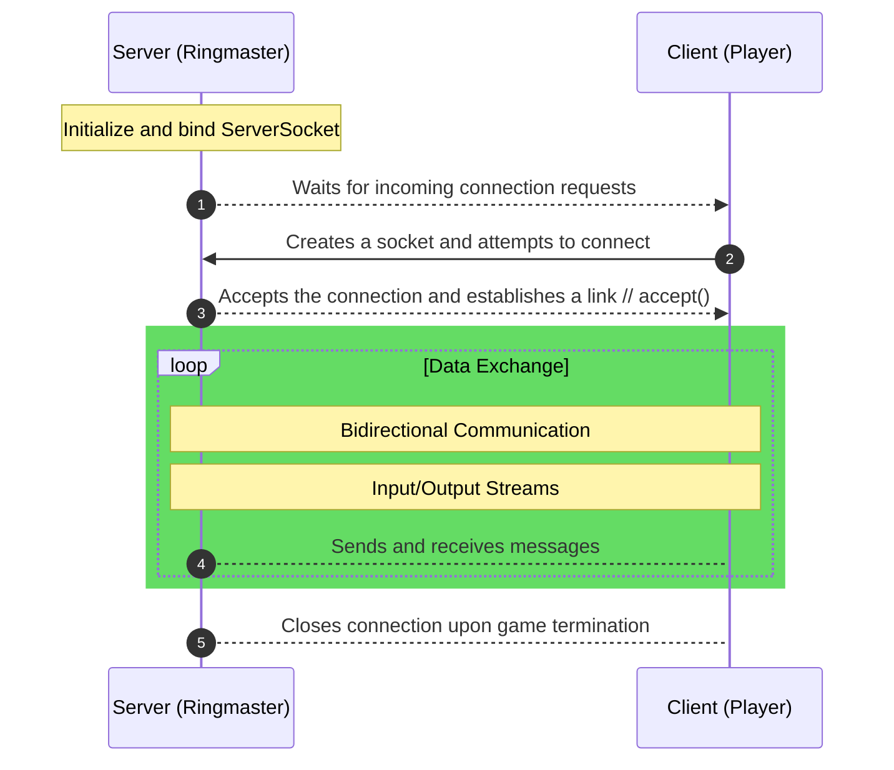

# TCP_Programming
 
## Socket Introduction

## Implementation Description

Implementation Overview
This project simulates the game "Hot Potato," where multiple players pass a "potato" among themselves until the game stops at a random moment. The player holding the potato at that point is declared "it." The goal of the game is to avoid being the last player holding the potato.

In this implementation, multiple "player" processes will be set up in a circular arrangement to pass the potato around. Each player has a neighboring player on both the left and right. Additionally, a "ringmaster" process is responsible for initializing the game, tracking the results, and shutting down the game once completed.

## How the Game Works:
1. The ringmaster begins by creating a "potato" object with a predefined number of hops and sends it to a randomly chosen player.
2. When a player receives the potato:
	The player decreases the hop counter and appends their unique player ID to the potato (each player ID is assigned according to the details in the Communication Mechanism section).
	Depending on the remaining hops:
		If there are still hops left, the player selects a neighbor at random and passes the potato to them.
		If the hop count reaches zero, the game ends. The player holding the potato returns it to the ringmaster, signaling the game’s completion.

3.The ringmaster logs the full sequence of the game (by printing the IDs recorded on the potato) and sends termination messages to all players so they can exit properly.

The goal of the assignment is to design and execute a single ringmaster process along with multiple player processes. The processes should be initiated and terminated in a controlled manner, ensuring that all players exit cleanly after receiving shutdown instructions from the ringmaster.

### Responsibilities of the Ringmaster
Establish socket connections with N players and distribute relevant details to each (refer to the Communication Mechanism section for specifics).
Create and initialize the "potato" object.
Randomly select a player and send them the potato.
When the game ends (i.e., the potato is returned to the ringmaster), display the game trace on the screen.
Gracefully shut down the game by instructing all players to terminate.

### Responsibilities of the Player
1.Maintain three socket connections for communication:
	One with the left neighbor.
	One with the right neighbor.
	One with the ringmaster.
2.Continuously listen on all three channels since the potato or game-related messages may arrive from any of them.
3.Appropriately process received messages according to the game rules.
